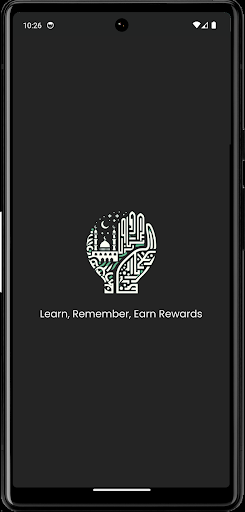
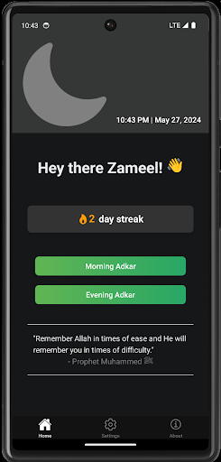
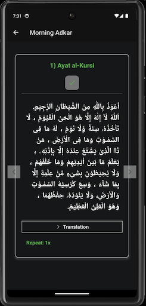

> Find the source code here: [Adkar Champ](https://github.com/zameel7/adkar-streak)

<div align="center">
    {: width="100px"}
    <h1>Adkar Champ</h1>
</div>

<br>

<div align="center">

[](https://www.buymeacoffee.com/zameel7)


[](https://github.com/zameel7/adkar-streak/blob/main/LICENSE.md)


</div>

<div align="center">
    [Get it on Google Play](https://play.google.com/store/apps/details?id=com.zameel7.adkarstreak&pcampaignid=pcampaignidMKT-Other-global-all-co-prtnr-py-PartBadge-Mar2515-1){: width="200"}
</div>

<div align="center">Adkar Champ! This app is designed to help you remember Allah and keep track of your daily adkar. We also have streaks to keep you motivated. If you like our app, please consider supporting me by buying me a coffee. <br><br><b>Jazakallah Khair!</b></div>
<br>

## Screenshots

<div align="center">
    {: width="245"}
    {: width="245"}
    {: width="245"}
</div>

## Development

1. **Install dependencies**

        ```bash
        npm install
        ```

2. **Start the app**
        ```bash
        npx expo start
        ```

> For iOS development, please switch to the `ios` branch as LinearGradient is not supported in iOS.

In the output, you'll find options to open the app in a

-   [Development build](https://docs.expo.dev/develop/development-builds/introduction/)
-   [Android emulator](https://docs.expo.dev/workflow/android-studio-emulator/)
-   [iOS simulator](https://docs.expo.dev/workflow/ios-simulator/)
-   [Expo Go](https://expo.dev/go), a limited sandbox for trying out app development with Expo

<br>

<span style="color: #9998;">Google Play and the Google Play logo are trademarks of Google LLC.</span>
